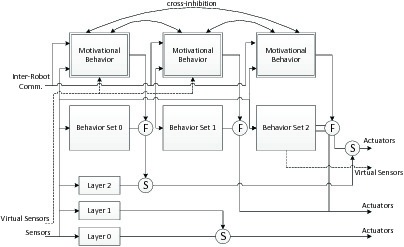
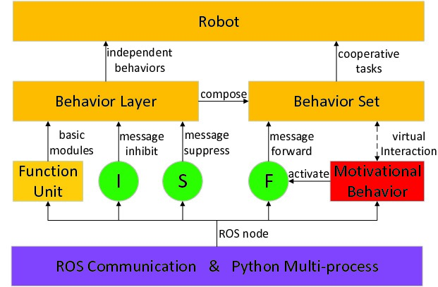
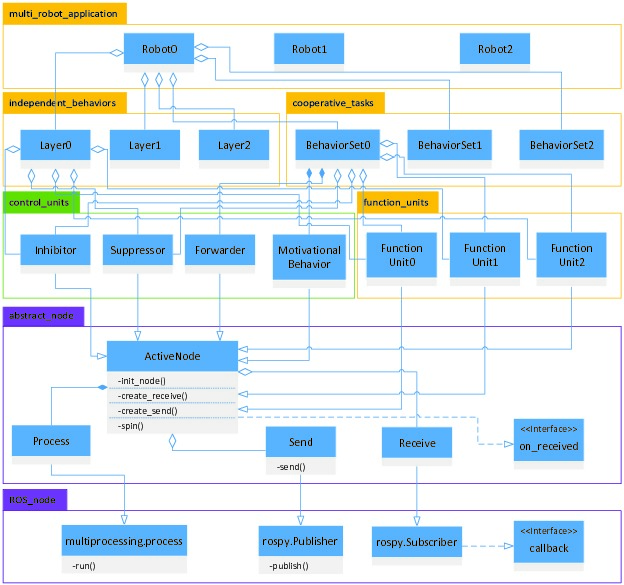
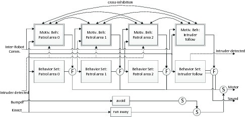
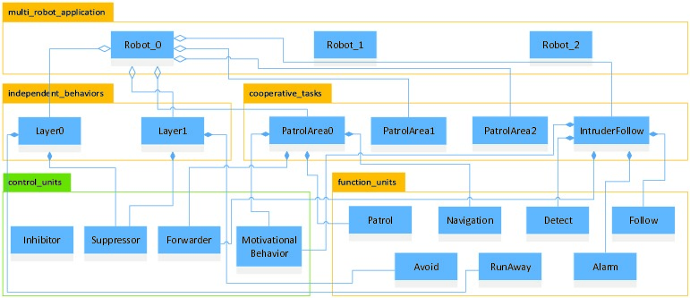
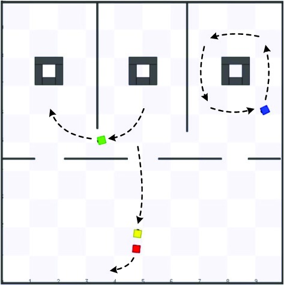
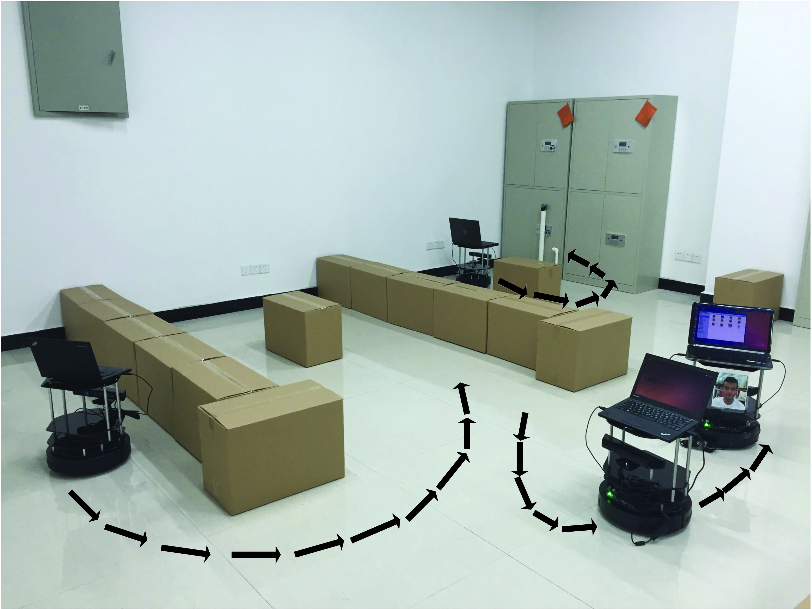

# micros_mars_task_alloc
A cooperative robot team is a multi-agent robot system in essence. In the team, each robot can be seen as an intelligent agent. This is a ROS package used for the mult-task allocation in a robot team. It is based on Multi-Agent theory and is an abstraction of ALLIANCE model. We have developed a prototype system by python hitherto. The nodelet-based C++ version is being developed and will be released in short time periods. 

##ALLIANCE model

<center>

</center>

ALLIANCE model is a natural extension of Brooks' famous subsumption model, which is applicable to fault-tolerant cooperative multi-robot systems. As shown in the figure above, each single robots in the cooperative team should obey a same ALLIANCE model. The model is composed of several behavior sets and behavior layers. Both of them are implemented by following the subsumption model. The behavior sets correspond to some high-level task-achieving functions. The module named 'motivational behavior' can activate the behavior sets to select a task adaptively. The 'F' circles in the figure above connect the output of each motivational behavior with the output of its corresponding behavior set indicating that a motivational behavior either allows all or none of the outputs of its behavior set to pass through to the robot's actuators. The lower several layers of the ALLIANCE architecture composed a subsumption model, we can also use the subsumption method to coordinate the behavior inside the behavior sets. Note that the motivational behavior needs to receive the sensor information. Besides, the output of some behavior set can also be used as the sensor information, which is called `virtual sensors' in ALLIANCE model(imaginary lines in the figure above). 

##General Overview
<center>

</center>

At the bottom layer, we encapsulate the ROS communication and python multi-process libraries into ROS node classes. By inheriting the ROS node classes, one may implement Function Units and connect them (i.e. establish message passing channels among them) to construct Behavior Layers quite conveniently. To do that, one could focus only on application logic, leaving others to the framework. Besides, several ALLIANCE elements including Inhibitors, Suppressors and Forwarders (i.e. the 'I', 'S' and 'F' circles) are all available, which can be directly put between Behavior Layers to construct Behavior Sets. A Motivational Behavior template is also available for developers. Once again, one could focus only on the parameters of the Motivational Behavior, others including the following three aspects are already handled by the framework:

* The fault-tolerant adaptive multi-task selection algorithm that incorporates the use of mathematically-modeled motivations.
* The interconnected communication among all motivational behaviors in the team robots by using ROS broadcasting mechanism.
* By specifying the forwarder name as a parameter, the interaction with the behavior set can be built automatically.

Finally, Behavior Layers and Behavior Sets can aggregate the Robots. 


##UML Graph
The UML graph shows the overall software architecture of the package.
<center>

</center>

##Main APIs
The main APIs are shown below. The parameter names present the parameter function clearly. As mentioned above, each motivational behavior is responsible for activating a forwarder to forward the messges sent from the attached behavior set. So the 'MotivationalBehavior' class should have a parameter named 'forwarder_name' indicating that which forwarder it activates. The paramters of the topics in 'Forwarder' indicate which behavior set they attach.

```python
Inhibitor(inhibitor_name, topic_in, in_out_msg_type, topic_out, inhibiting_topic, inhibiting_msg_type)
suppressor(suppressor_name, topic_in, in_out_msg_type, topic_out, suppressing_topic, suppressing_msg_type)
Forwarder(forwarder_name, topic_1_in , msg_1_type, topic_1_out, topic_2_in, msg_2_type, topic_2_out)
MotivationalBehavior(motivational_behavior_name, robot_ID, behavior_set_ID, forwarder_name)
```

##A Demo
We assume a scenario that there are three rooms in a house and each robot patrols a room according to several pre-selected goals. If another intruder robot moves into the house, one of the three patrol robots can detect it, follow it and alarm. But at the same time, the room the robot patrols before is empty. So the other two patrol robots will compensate for this fault and patrol different rooms alternately. Besides, during the whole system running, one of the robot may break down, the other two robots may also compensate the fault according to the way mentioned above. We have used the package to develop the system. 

* The ALLIANCE model and UML graph of the application is shown in the figures below

<center>

</center>

<center>

</center>


* The exprimental result is shown in the figures below.

<center>

</center>

<center>

</center>

If you want to test the demo yourself, please follow the steps below.

* environmental configuration

Notice that, the multi-robot task need multi-robot collision avoidance. One ROS package can help you do this, so you should git clone and compile the collvoid package first.
```
git clone https://github.com/daenny/collvoid.git
```
The package needs a simulated environment supporting multi-robot navigation without confliction (the prefixes of the namespace and TF may conflict with each other). You should git clone the multi_robot_stage package in your own catkin_ws.
```
git clone https://github.com/liminglong/multi_robot_stage.git
```
And then git clone this package micros_mars_task_alloc in your workspace.
```
git clone https://github.com/liminglong/micros_mars_task_alloc.git
```
Finally, even all the codes are witten in python, you should compile the files in your workspace again. Such that the added message files can be imported by the python modules. Don't forget to source your setup.bash.

* run the demo
First, launch the simulated multi-robot environment.
```
roslaunch multi_robot_stage multi_robot.launch
```
Run the following commands in your terminal.
```
cd /catkin_ws/src/micros_mars_task_alloc/scripts/basic_support
```
Use the python interpreter to start the first robot.
```
python robot0.py
```
Open a new terminal in the same directory to start the second robot.
```
python robot1.py
```
Open another new ternimal in the same directory to run the third robot.
```
python robot2.py
```
Then the whole system will run as a whole. The three robots patrol the three rooms.
Besides, you can also control a suspicious robot to invade the room.
```
roslaunch micros_mars_task_alloc robot3_control.launch
```
One of the robot can detect and follow it immediately. The remained room will not be empty, because the other two robots will patrol the three rooms alternatively and compensate for this fault.

##Videos
The experimental videos can be downloaded and watched [here.](https://www.trustie.net/organizations/61)
